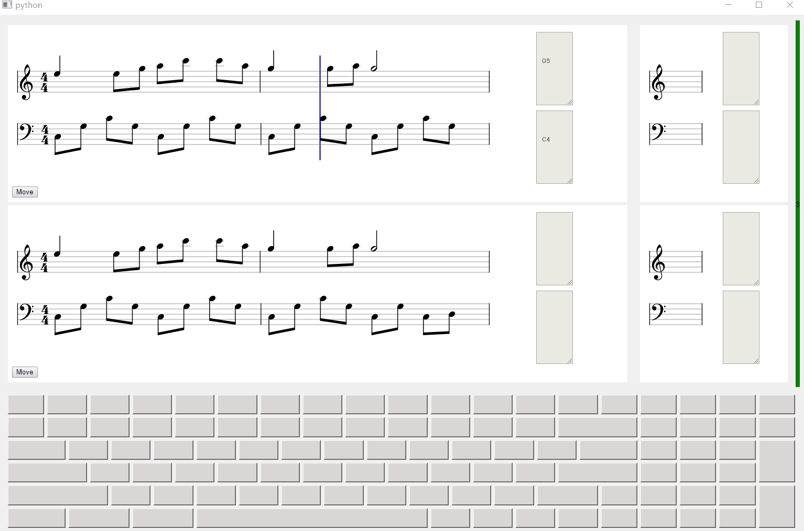

# In Memory of
2017-2018, my lost days in University, in which I found solace in music and piano. I learned music theory and piano playing by myself, 
but in return, I managed my study and mental status poorly. That is not a period of proud, but definitely of respect and redemption. 

# Current functionality
- playing music by keyboard.
- music, e.g. __Molihua__, auto-playing. 

- pausing and resuming auto-playing.
- music practice, hit the right key and go alone.

# Future functionality
- open any correctly composed `.abc` music file.
- UI improvement.
- midi device support.
